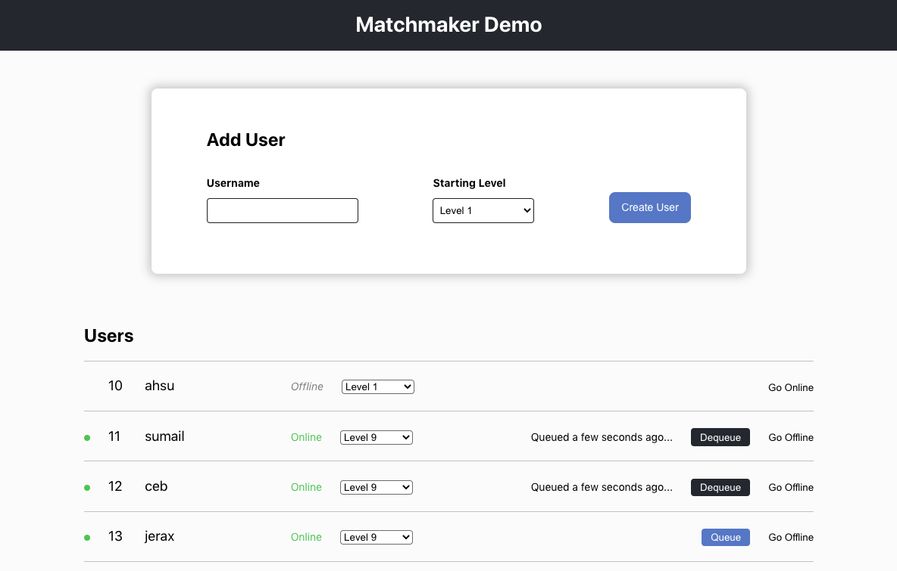
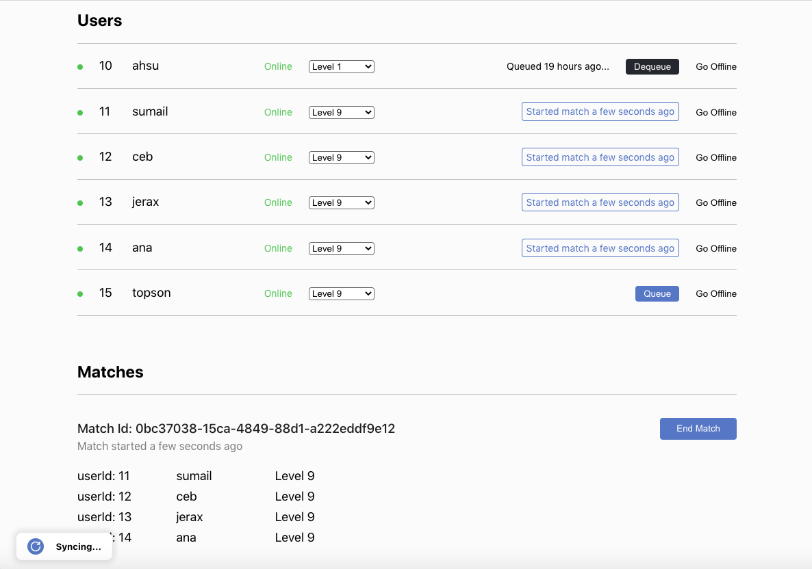
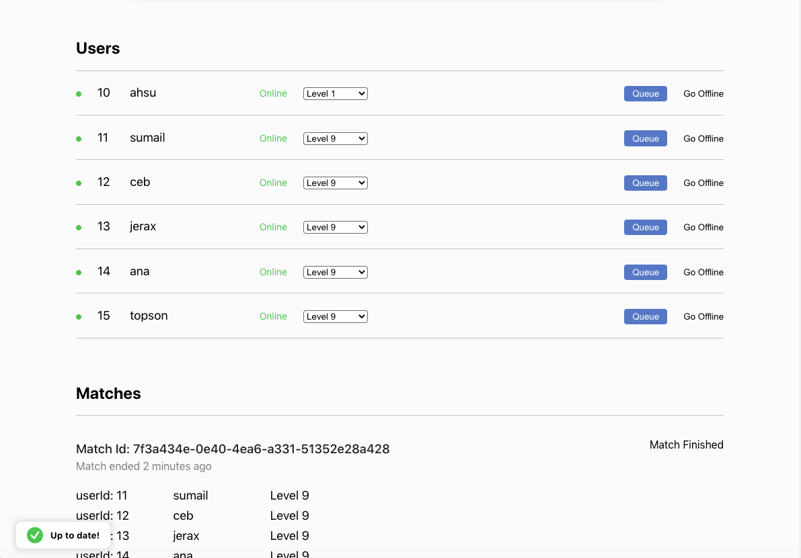

# KafkaDemo

This is a Kafka Demo and a report of what I've found in my research.

## Running the demo

- Run `MainService.java` found in `kafka/src/main/java/services/`. No special arguments required.
- Run `npm start` found in `site` to spin up the website.

## Application

This application demonstrates how a Matchmaking system for an online game can be implemented using Kafka.
The process of matchmaking usually depends on time-driven events. For example, when enough users come online and "Queues" for a game, they may be placed into the same match if enough players of the same level are queueing.

All of these events are triggered by the admin dashboard site for demo purposes, but when these events are triggered by multiple clients, Kafka is a great way to keep track of states for particular users.

When enough users (4 in this case) of the same level are Queue'd, we can start a match with those 4 users. From there, we reflect their match status.

When they are finished playing the match, they should return to their normal state and can decide to Queue again.

